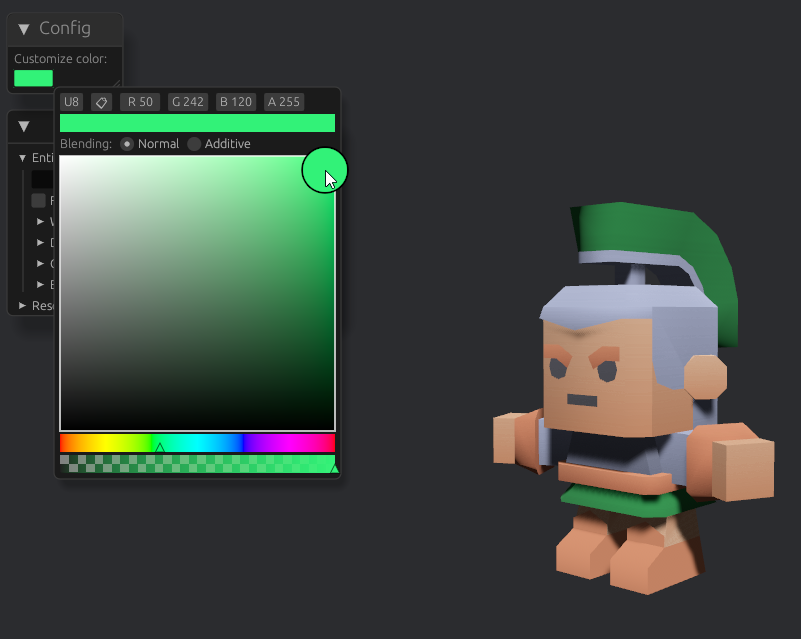

# Bevy Texture Coloring Example

This example demonstrates how to customize an existing material loaded from a glTF scene in Bevy. It leverages the `bevy-scene-hook` crate to replace specific materials during the loading process. Please note that this might not be the most elegant solution.

## Screenshot

## Approach

This solution involves three main components:

1. **Mask Texture** (`assets/Textures/mask.png`):
   - A manually created texture that acts as a mask, determining the customizable part of the texture via the alpha channel.

2. **Custom Shader** (`assets/shaders/custom_material.wgsl`):
   - An extension to the standard PBR shader that masks and colors specific regions of the base texture.

3. **Plugin Implementation** (`src/soldier.rs`):
   - Loads the glTF scene.
   - Hooks into the loading process to remove the original material and add a marker component to the targeted entities.
   - Applies a custom material to the marked entities.
   - Updates the custom color in the material based on input from the UI.

Feel free to provide any feedback or suggestions to improve this example further!